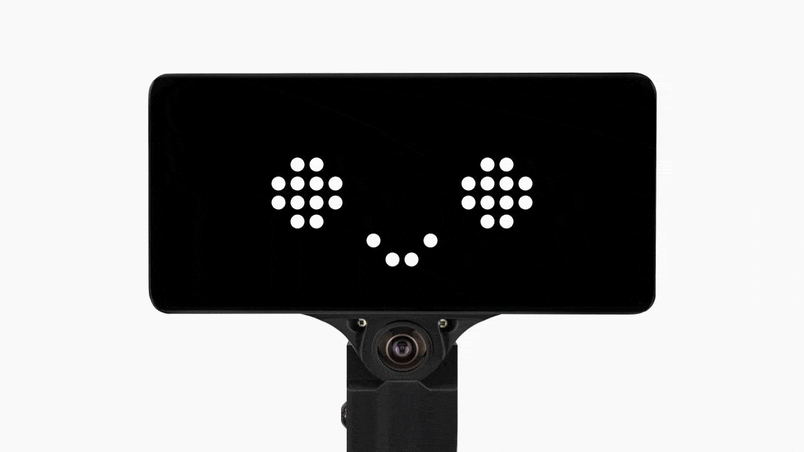

# bodyjim

[comma body](https://www.comma.ai/shop/body) gymnasium environment API.

<p align="center">
  
</p>

## Installation

To install `bodyjim` run the following command:
```
pip install bodyjim
```

Package requires comma body with comma three/threex running openpilot 0.9.6 or newer.

## Usage

Just like other `gymnasium` environments, `bodyjim` is easy to use. Base `BodyEnv` accepts ip address of the body, list of cameras to stream (valid values: `driver` - driver camera, `road` - front camera, `wideRoad` - front wide angle camera) and list of cereal services to stream ([list of services](https://github.com/commaai/cereal/blob/master/services.py)).

Environment's `step` method accepts action in x, y direction coordinates and retrieves next observation in form of a dict with latest camera frames and cereal messages ([structure definitions](https://github.com/commaai/cereal/blob/master/log.capnp)) received so far. Additional info dictionary contains information about message creation timestamps and validity (which are None, if they haven't been received yet).

```py
from bodyjim import BodyEnv

body_address = ... # body ip address, pass localhost if running locally on the body
env = BodyEnv(body_address, ["driver"], ["accelerometer", "gyroscope"], render_mode="human")
env.reset()

# action coordinates assuming the front is the screen-facing side
# x-axis: Forward (negative) / Backwards (positive)
# y-axis: Left (positive) / Right (negative)
action = (1.0, 0.0) # (x, y)
obs, reward, done, truncated, info = env.step(action)

# obs  = { "cameras": { "driver": np.ndarray }, "accelerometer": {...}, "gyroscope": {...} }
# info = { "times": <dict_of_ns_timestamps_for_each_service>, "valid": <dict_of_message_validity_for_each_service> }
driver_image = obs["camera"]["driver"] # nd.ndarray
accelerometer, accelerometer_t = obs["accelerometer"], info["times"]["accelerometer"]
```

By default body environment always returns reward = 0 and done = False. Subclasses can customize this behavior by overriding `reward` and `is_done` methods:

```py
class CustomBodyEnv(BodyEnv):
  def reward(self, obs: Optional[ObsType], action: ActType, next_obs: ObsType) -> float:
    # obs - latest observations, action - most recently executed actions, next_obs - observations after executing such action
    ...

  def is_done(self, obs: Optional[ObsType], action: ActType, next_obs: ObsType) -> bool:
    # same as for reward
    ...
```

`BodyEnv` supports two rendering modes for visualization purposes:
* `rgb_array` - returns image formed by horizontally stacking frames from each requested camera
* `human` - displays pygame window with live view from cameras


## Examples

Repository comes with few examples, showcasing how to use the library.

Examples require additional dependencies, which can be installed using:

```sh
pip install bodyjim[examples]
```

To control the body with wasd:
```sh
python3 examples/wasd.py body_ip_address [CAMERA...]
```

To perform "random walk":
```sh
python3 examples/random_walk.py body_ip_address [CAMERA...]
```

To try follow person mode, which uses YOLOv5 to detect and follow the tallest person in the frame:
```sh
python3 examples/follow_human.py body_ip_address
```
